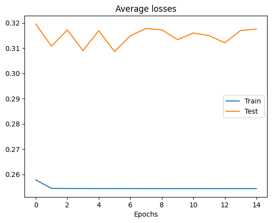
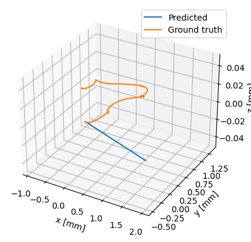

# Project README

## Overview

The aim of this project is to leverage Artificial Intelligence for state estimation. Specifically, we will implement various neural network architectures such as LSTM and Transformers to predict changes in heading angle and displacement. This prediction will be based on IMU data recorded using the ROS Gazebo simulator.

We will utilize TurtleBot3 as the mobile robot to gather measurements within the Gazebo environment. For ease of use, we have developed a Python script, `turtlebot3_waypoints.py`, to facilitate the recording of bagfiles from the simulations.

## Steps

To achieve our objectives, we will follow these steps:

1. **Launch TurtleBot3 inside Gazebo**: Begin by initializing TurtleBot3 within the Gazebo simulation environment.
    ```
    cd ~/catkin_ws
    catkin_make
    source devel/setup.bash
    export TURTLEBOT3_MODEL=burger
    roslaunch turtlebot3_gazebo turtlebot3_world.launch
    ```

2. **Run Navigation Node**: Execute the Navigation node to perform Initial Pose estimation and gather information about the surrounding environment.
    ```
    export TURTLEBOT3_MODEL=burger
    roslaunch turtlebot3_navigation turtlebot3_navigation.launch 
        map_file:=$HOME/map.yaml
    ```

3. **Launch Recording Script**: Utilize the script `turtlebot3_waypoints.py` to record the bagfile generated during the simulation.
    ```
    roslaunch turtlebot3_waypoints turtlebot3_waypoints.launch
        bagfile:=/home/lorenzo/runs/run.bag
    ```

4. **Index Bagfiles**: Index all obtained bagfiles to optimize storage space and facilitate access.
    ```
    rosbag reindex run.bag
    ```


5. **Launch Neural Network**: Run the neural network with the collected data and record the results for analysis.

## Results

The best results obtained are the following:
| model                                               | epochs | batch size | hidden size | loss                  | optimizer       | lr                        | train loss | test loss |
| --------------------------------------------------- | ------ | ---------- | ----------- | --------------------- | --------------- | ------------------------- | ---------- | --------- |
| LSTM                                                | 20     | 32         | 256         | MSE, reduction='mean' | adam, lr=0.0002 | step_size=200, gamma=0.01 | 0.1668     | 0.3618    |
| Transformer, dropout = 0.7                          | 15     | 4         | 6           | MSE, reduction='mean' | adamW, lr=0.0005, wd=0.001  | step_size=400, gamma=0.3  | 0.2543      | 0.3175    |


Results with LSTM:
Errors             |  Estimated trajectory
:-------------------------:|:-------------------------:
  |  

-------------------------------------

Results with Transformer:
Errors             |  Estimated trajectory
:-------------------------:|:-------------------------:
  |  

For the complete view, check the file `results.pdf`.
